<div align="center">

# Locate Anything in Videos: Rethinking Efficient Generative Spatio-Temporal Video Grounding

Hanoona Rasheed<sup>1</sup> · Haania Siddiqui<sup>1</sup> · Ming-Hsuan Yang<sup>2</sup> · Fahad Shahbaz Khan<sup>1,3</sup> · Salman Khan<sup>1,3</sup>

<sup>1</sup> Mohamed bin Zayed University of Artificial Intelligence · <sup>2</sup> University of California, Merced · <sup>3</sup> Apertix

<p>
  <a href="https://mbzuai.ac.ae/">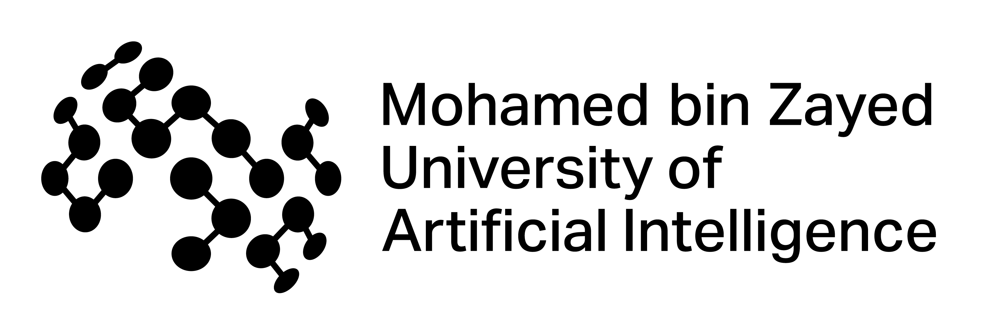</a>
  &nbsp;&nbsp;&nbsp;&nbsp;
  <a href="https://www.ucmerced.edu/"></a>
  &nbsp;&nbsp;&nbsp;&nbsp;
  <a href="https://apertix.tech/"></a>
</p>

[Project Page](https://mbzuai-oryx.github.io/parallel-tube-decoding/)

</div>

## Abstract

Spatio-temporal video grounding requires identifying when a queried event occurs and localizing the referred entity throughout that interval. We introduce **Parallel Tube Decoding (PTD)**, which predicts the temporal interval first and then decodes all time-conditioned spatial blocks in parallel. PTD reduces tube generation to two decoding rounds, independent of tube length, while improving both localization accuracy and inference efficiency.

## Contributions

- **Parallel tube generation.** PTD removes token-level and trajectory-level dependencies by generating the temporal block in one round and all spatial blocks in a second round.
- **Decoupled Block Attention.** Each spatial block uses the shared video-query context and predicted temporal interval without depending on other generated boxes.
- **Localization-aware optimization.** Complementary temporal and spatial rewards improve event boundaries, bounding-box geometry, and target consistency.
- **Efficiency and accuracy.** PTD achieves $79\times$ lower Tube Completion Latency and $92\times$ higher spatial decoding throughput than standard autoregressive decoding while improving grounding performance.

## Using the Code

| Component | Location |
| --- | --- |
| Prepare VidSTG and HC-STVG annotations | [Data preparation guide](data/README.md) and the [VidSTG](data/prepare_vidstg.py), [HC-STVG v1](data/prepare_hcstvg_v1.py), and [HC-STVG v2](data/prepare_hcstvg_v2.py) preparation scripts |
| Run SFT, merge the adapter, and run GRPO | [Training guide](ptd_scripts/README.md), [SFT launcher](ptd_scripts/train_sft.sh), [merge script](ptd_scripts/merge_lora.sh), and [GRPO launcher](ptd_scripts/train_grpo.sh) |
| PTD generation and attention masking | [PTD generation](src/model/ptd_generation.py) and [PTD mask utilities](src/model/ptd_mask_utils.py) |
| Evaluate VidSTG, HC-STVG, Charades-STA, and ActivityNet | [Evaluation guide](evaluation/README.md) and [lmms-eval task definitions](evaluation/lmms_eval/lmms_eval/tasks) |

## Parallel Tube Decoding

<p align="center">
  <video src="assets/videos/ptd_teaser.mp4" poster="assets/videos/ptd_teaser.jpg" width="100%" controls muted loop playsinline preload="metadata">
    <a href="assets/videos/ptd_teaser.mp4">Watch the PTD teaser video</a>
  </video>
</p>

<p align="center"><a href="assets/videos/ptd_teaser.mp4">Watch the teaser video</a></p>

<p align="center">
  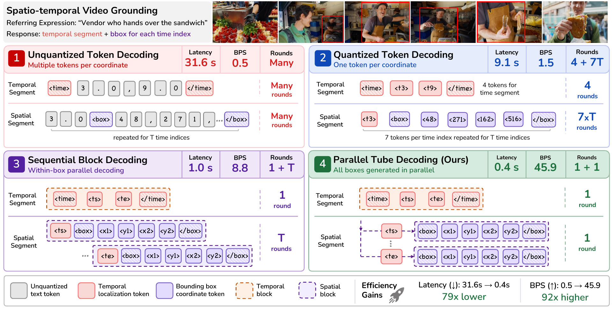
</p>

**Autoregressive localization vs. Parallel Tube Decoding.** Given a video and a referring expression, STVG predicts when the event occurs and the bounding box of the referred entity throughout that interval. PTD generates all time-conditioned spatial blocks in parallel after temporal localization, reducing the sequential decoding depth to $1 + 1$. Compared with standard Unquantized Token Decoding, PTD achieves $79\times$ lower Tube Completion Latency and $92\times$ higher spatial decoding throughput while improving spatio-temporal grounding accuracy.

<p align="center">
  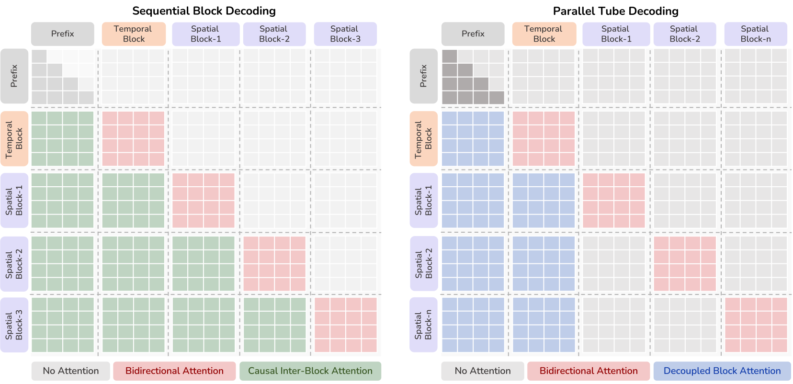
</p>

**MTP attention masks for Sequential Block Decoding and PTD.** Sequential Block Decoding retains causal attention across spatial blocks. PTD replaces this cross-box dependency with Decoupled Block Attention: every spatial block accesses the shared multimodal prefix and temporal block while all other spatial blocks remain masked.

## Main Results

### Decoding strategies

<p align="center">
  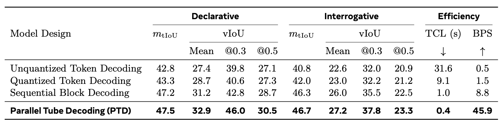
</p>

**Table 1: Comparison of decoding strategies on VidSTG.** We report temporal and video IoU for declarative and interrogative queries, together with Tube Completion Latency (TCL) and Boxes Per Second (BPS). Parallel Tube Decoding achieves the strongest grounding performance, lowest latency, and highest throughput.

<p align="center">
  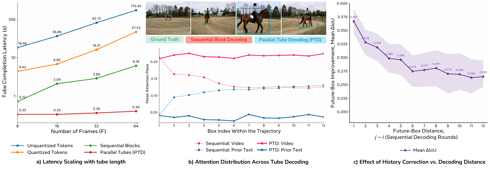
</p>

**Analysis of decoding efficiency and trajectory-level dependency.** (a) Tube completion latency as the number of grounded frames increases. PTD maintains nearly constant latency, while token-based and block decoding scale with tube length. (b) Attention distribution across tube decoding for Sequential Block Decoding (dotted) and PTD (solid). Sequential decoding progressively shifts attention from the video toward prior text. (c) History-correction analysis for Sequential Block Decoding. Replacing an erroneous box $B_i$ with its ground-truth box improves subsequent predictions, with the effect gradually decreasing as the decoding distance $j-i$ increases.

### Spatio-temporal video grounding

<p align="center">
  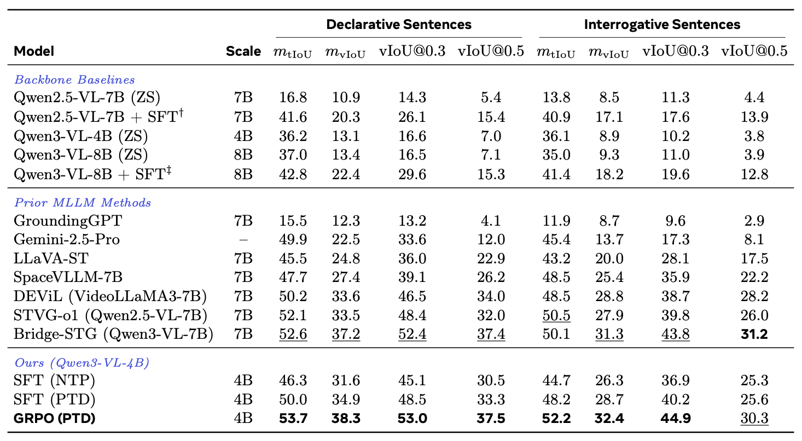
</p>

**Table 2: Results on VidSTG.** Comparison with backbone baselines and prior multimodal large language models for declarative and interrogative spatio-temporal grounding. Our compact Qwen3-VL-4B model with GRPO and PTD delivers the strongest overall results.

<p align="center">
  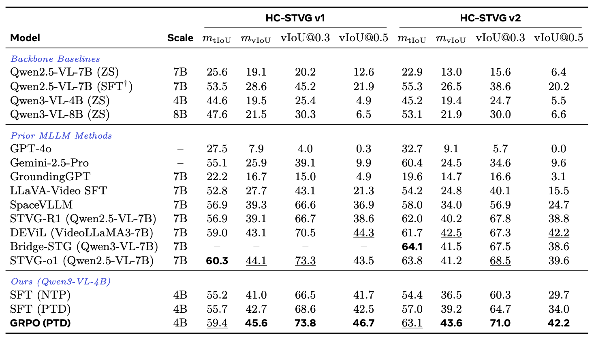
</p>

**Table 3: Results on HC-STVG.** Comparison with backbone baselines and prior methods on HC-STVG v1 and v2. PTD achieves strong temporal localization and the best video IoU across both benchmark versions.

### Generalization beyond STVG

<p align="center">
  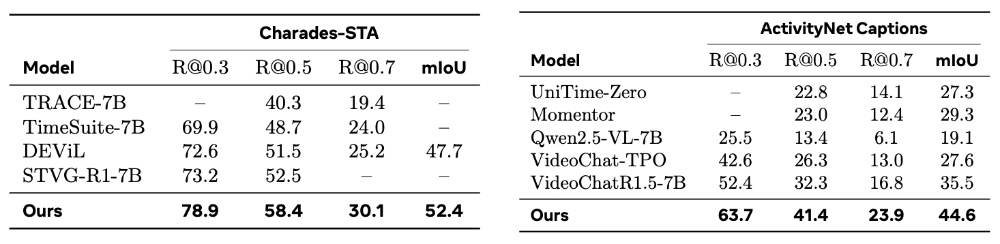
</p>

**Table 4: Zero-shot temporal grounding.** Results on Charades-STA and ActivityNet Captions without task-specific training. Our model improves over the strongest prior zero-shot methods, including under stricter temporal-overlap thresholds.

<p align="center">
  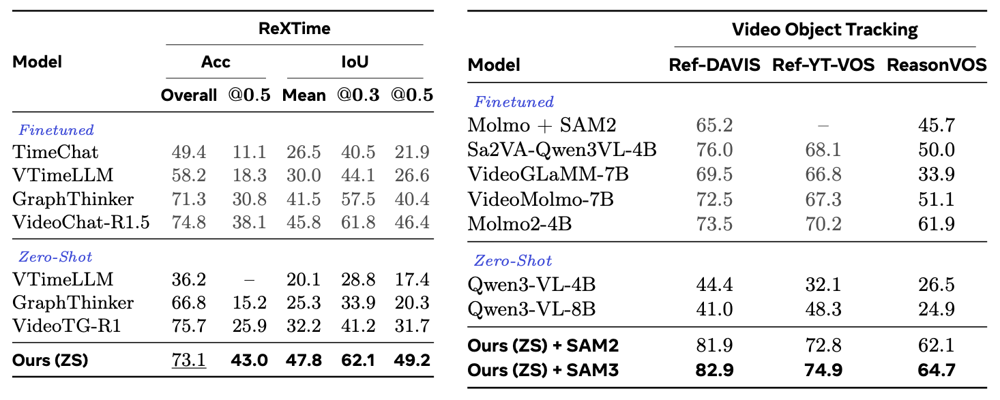
</p>

**Table 5: Generalization to grounded VideoQA and video object tracking.** Left: zero-shot evidence-aware question answering on ReXTime. Right: referring video object tracking on Ref-DAVIS, Ref-YT-VOS, and ReasonVOS using SAM2 or SAM3.

### Ablation study

<p align="center">
  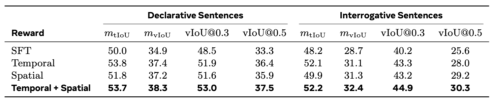
</p>

**Table 6: Ablation of localization-aware rewards.** Temporal and spatial rewards provide complementary improvements for declarative and interrogative grounding. Combining both produces the strongest overall spatio-temporal localization performance.

## Qualitative Results

<p align="center">
  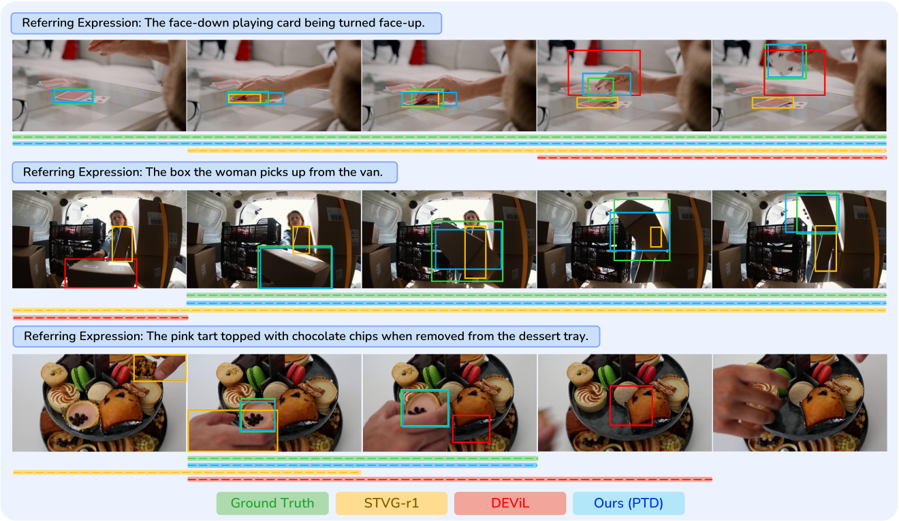
</p>

**Comparison with prior STVG methods.** PTD directly generates both the temporal interval and complete spatial tube. The examples highlight fine-grained target identification among visually similar distractors, large changes in object scale, and event-specific temporal localization. Bounding boxes show spatial predictions, while the horizontal lines indicate the predicted temporal intervals.

<p align="center">
  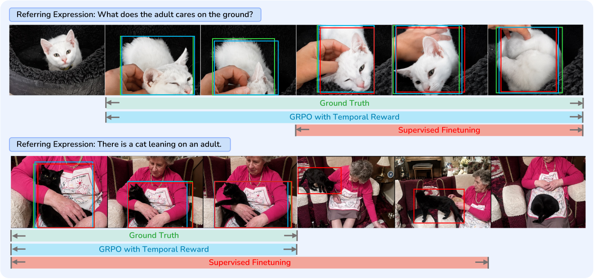
</p>

**Effect of the temporal reward.** The first example shows how the reward recovers the complete interaction when SFT localizes only its most salient portion. The second shows how it prevents the prediction from extending beyond the queried event while the target remains visible.

<p align="center">
  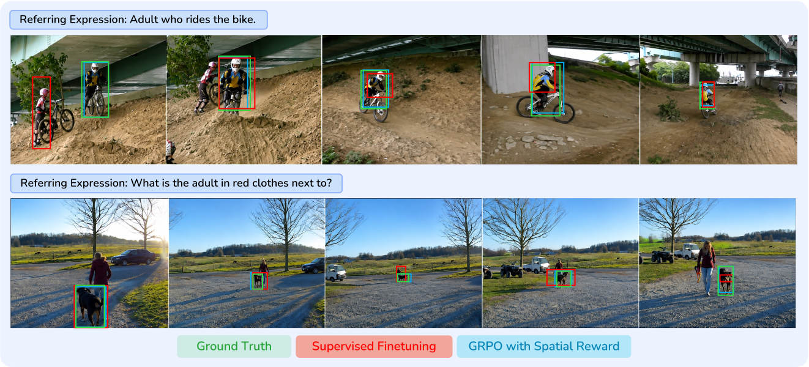
</p>

**Effect of the spatial reward.** The examples highlight tighter localization under rapid motion and more consistent target identity despite substantial scale changes and interference from nearby entities.

<p align="center">
  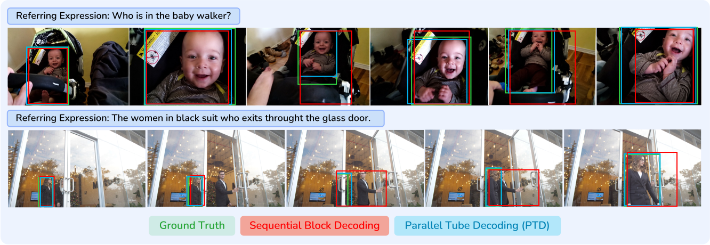
</p>

**Sequential Block Decoding vs. PTD.** Abrupt scale changes and partial occlusion expose how Sequential Block Decoding propagates localization errors across subsequent boxes. PTD maintains tighter target localization by removing cross-box dependencies.

<p align="center">
  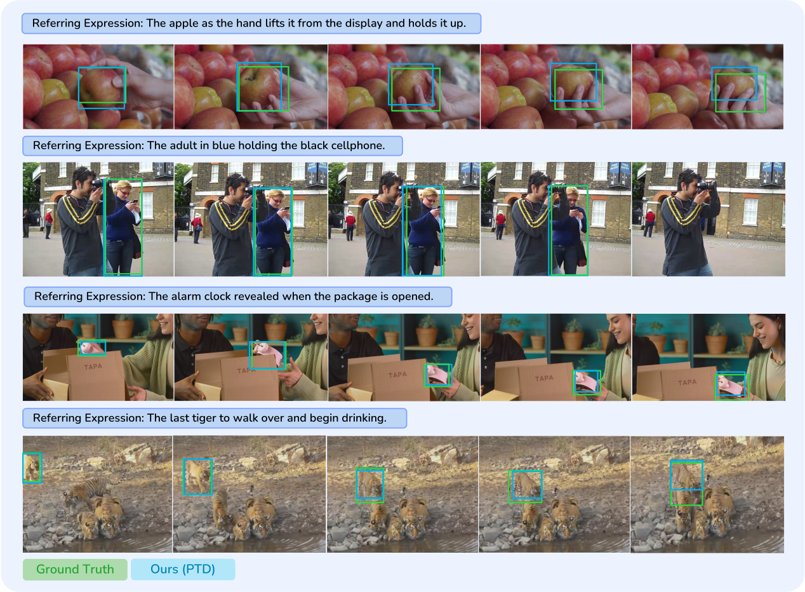
</p>

**Additional qualitative results.** PTD accurately localizes the queried entity under visually similar distractors, target motion and scale changes, partial occlusion, progressive object reveal, and multi-instance interactions.

<p align="center">
  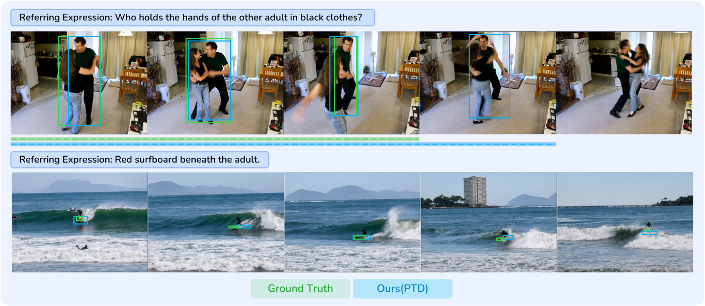
</p>

**Representative failure cases.** Temporally subtle state changes can produce ambiguous event boundaries, while spatial localization becomes difficult for small, rapidly moving, or occluded targets.

## Citation

```bibtex
@misc{rasheed2026locateanythingvideos,
  title  = {Locate Anything in Videos: Rethinking Efficient Generative Spatio-Temporal Video Grounding},
  author = {Hanoona Rasheed and Haania Siddiqui and Ming-Hsuan Yang and Fahad Shahbaz Khan and Salman Khan},
  year   = {2026}
}
```
