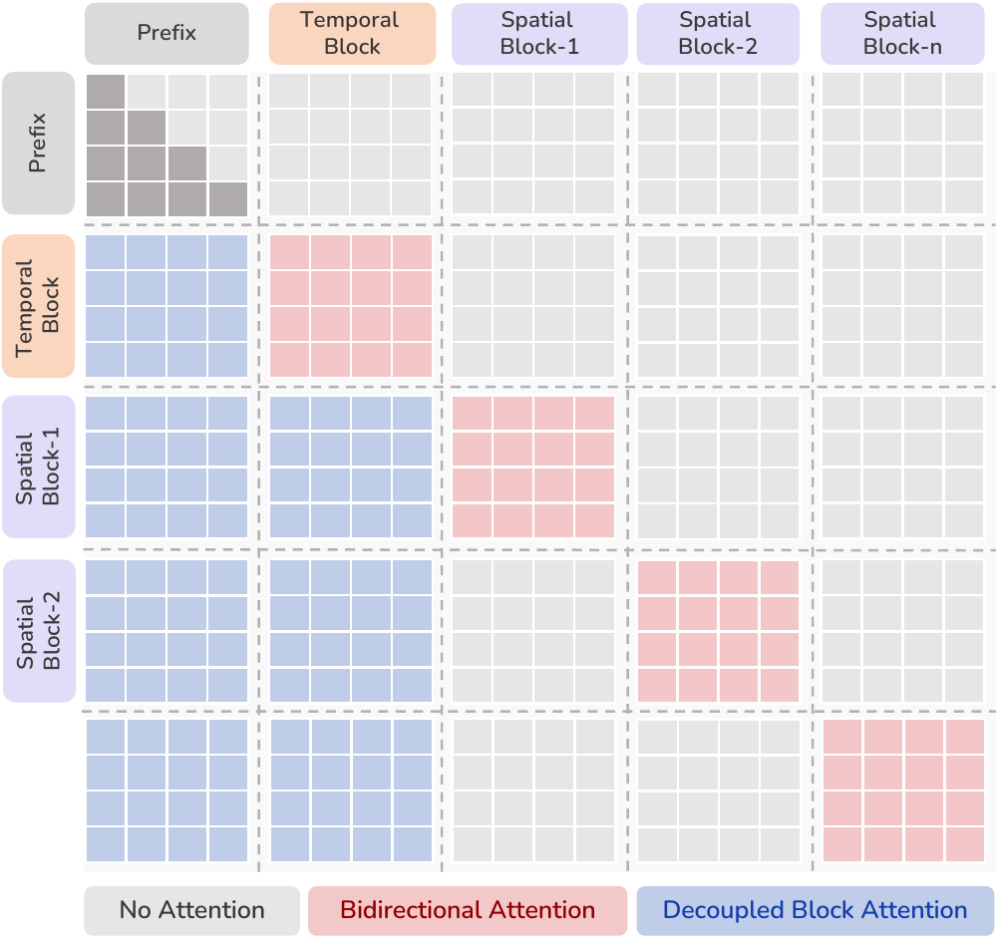

<div align="center">

# Locate Anything in Videos: Rethinking Efficient Generative Spatio-Temporal Video Grounding

[Hanoona Rasheed](https://hanoonar.github.io/)<sup>1</sup> · Haania Siddiqui<sup>1</sup> · Ming-Hsuan Yang<sup>2</sup> · Fahad Shahbaz Khan<sup>1,3</sup> · Salman Khan<sup>1,3</sup>

<sup>1</sup> Mohamed bin Zayed University of Artificial Intelligence<br>
<sup>2</sup> University of California, Merced<br>
<sup>3</sup> Apertix

<p>
  <a href="https://mbzuai.ac.ae/"></a>
  &nbsp;&nbsp;&nbsp;&nbsp;
  <a href="https://www.ucmerced.edu/"></a>
  &nbsp;&nbsp;&nbsp;&nbsp;
  <a href="https://apertix.tech/"></a>
</p>

[Project Page](https://mbzuai-oryx.github.io/parallel-tube-decoding/)

</div>

## Abstract

Spatio-temporal video grounding (STVG) requires models to identify when a referred event occurs and localize the target entity throughout that interval. Existing multimodal large language models typically serialize dense localization trajectories autoregressively, causing decoding latency to grow with tube length and allowing localization errors to propagate across time. We introduce **Parallel Tube Decoding (PTD)**, a generative formulation that decomposes grounding into a temporal block followed by time-conditioned spatial blocks decoded simultaneously. This removes both token-level and trajectory-level dependencies, reducing the sequential decoding depth to a fixed $1 + 1$ rounds, independent of tube length. To enable parallel spatial generation, we introduce Decoupled Block Attention, which preserves access to shared video-query context while eliminating cross-box dependencies, together with localization-aware policy optimization for temporal boundaries and spatial geometry. On VidSTG, PTD reduces Tube Completion Latency by $79\times$ and increases spatial decoding throughput by $92\times$ over standard autoregressive decoding, while also improving grounding accuracy. With a compact 4B backbone, our model performs favorably on VidSTG and HC-STVG, and generalizes zero-shot to temporal grounding, grounded VideoQA, and referring video object tracking. Our results show that parallel tube generation is an efficient and effective alternative to autoregressive localization in videos.

## Parallel Tube Decoding

<p align="center">
  
</p>

**Autoregressive localization vs. Parallel Tube Decoding.** Given a video and a referring expression, STVG predicts when the event occurs and the bounding box of the referred entity throughout that interval. PTD generates all time-conditioned spatial blocks in parallel after temporal localization, reducing the sequential decoding depth to $1 + 1$. Compared with standard Unquantized Token Decoding, PTD achieves $79\times$ lower Tube Completion Latency and $92\times$ higher spatial decoding throughput while improving spatio-temporal grounding accuracy.

<p align="center">
  
</p>

**Decoupled Block Attention in PTD.** Each spatial block attends to the shared multimodal prefix and temporal block, uses bidirectional attention within the block, and remains isolated from other spatial blocks, enabling parallel tube generation.

<p align="center">
  
</p>

**MTP attention masks for Sequential Block Decoding and PTD.** Sequential Block Decoding retains causal attention across spatial blocks. PTD replaces this cross-box dependency with Decoupled Block Attention: every spatial block accesses the shared multimodal prefix and temporal block while all other spatial blocks remain masked.

## Main Results

### Decoding strategies

<p align="center">
  
</p>

**Table 1: Comparison of decoding strategies on VidSTG.** We report temporal and video IoU for declarative and interrogative queries, together with Tube Completion Latency (TCL) and Boxes Per Second (BPS). Parallel Tube Decoding achieves the strongest grounding performance, lowest latency, and highest throughput.

<p align="center">
  
</p>

**Analysis of decoding efficiency and trajectory-level dependency.** (a) Tube completion latency as the number of grounded frames increases. PTD maintains nearly constant latency, while token-based and block decoding scale with tube length. (b) Attention distribution across tube decoding for Sequential Block Decoding (dotted) and PTD (solid). Sequential decoding progressively shifts attention from the video toward prior text. (c) History-correction analysis for Sequential Block Decoding. Replacing an erroneous box $B_i$ with its ground-truth box improves subsequent predictions, with the effect gradually decreasing as the decoding distance $j-i$ increases.

### Spatio-temporal video grounding

<p align="center">
  
</p>

**Table 2: Results on VidSTG.** Comparison with backbone baselines and prior multimodal large language models for declarative and interrogative spatio-temporal grounding. Our compact Qwen3-VL-4B model with GRPO and PTD delivers the strongest overall results.

<p align="center">
  
</p>

**Table 3: Results on HC-STVG.** Comparison with backbone baselines and prior methods on HC-STVG v1 and v2. PTD achieves strong temporal localization and the best video IoU across both benchmark versions.

### Generalization beyond STVG

<p align="center">
  
</p>

**Table 4: Zero-shot temporal grounding.** Results on Charades-STA and ActivityNet Captions without task-specific training. Our model improves over the strongest prior zero-shot methods, including under stricter temporal-overlap thresholds.

<p align="center">
  
</p>

**Table 5: Generalization to grounded VideoQA and video object tracking.** Left: zero-shot evidence-aware question answering on ReXTime. Right: referring video object tracking on Ref-DAVIS, Ref-YT-VOS, and ReasonVOS using SAM2 or SAM3.

### Ablation study

<p align="center">
  
</p>

**Table 6: Ablation of localization-aware rewards.** Temporal and spatial rewards provide complementary improvements for declarative and interrogative grounding. Combining both produces the strongest overall spatio-temporal localization performance.

## Qualitative Results

<p align="center">
  
</p>

**Comparison with prior STVG methods.** PTD directly generates both the temporal interval and complete spatial tube. The examples highlight fine-grained target identification among visually similar distractors, large changes in object scale, and event-specific temporal localization. Bounding boxes show spatial predictions, while the horizontal lines indicate the predicted temporal intervals.

<p align="center">
  
</p>

**Effect of the temporal reward.** Green, red, and blue denote the ground-truth, SFT, and GRPO with temporal reward predictions, respectively. The temporal reward improves boundary prediction so that the generated tube aligns with the complete temporal extent of the queried event.

<p align="center">
  
</p>

**Effect of the spatial reward.** Green, red, and blue denote the ground-truth, SFT, and GRPO with spatial reward predictions, respectively. The spatial reward improves bounding-box precision and consistent target localization under rapid motion, changes in scale, and nearby distractors.

<p align="center">
  
</p>

**Sequential Block Decoding vs. PTD.** Green, red, and blue denote the ground-truth, Sequential Block Decoding, and PTD predictions, respectively. Sequential Block Decoding propagates localization errors across subsequent boxes, whereas PTD maintains tight target localization by removing cross-box dependencies.

<p align="center">
  
</p>

**Additional qualitative results.** PTD accurately localizes the queried entity under visually similar distractors, target motion and scale changes, partial occlusion, progressive object reveal, and multi-instance interactions.

<p align="center">
  
</p>

**Representative failure cases.** Temporally subtle state changes can produce ambiguous event boundaries, while spatial localization becomes difficult for small, rapidly moving, or occluded targets. Green and blue denote the ground-truth and PTD predictions, respectively; the horizontal lines indicate their temporal intervals.

## Code

- [Dataset preparation](data/README.md)
- [SFT and GRPO training](ptd_scripts/README.md)
- [Evaluation with lmms-eval](evaluation/README.md)

## Citation

```bibtex
@misc{rasheed2026locateanythingvideos,
  title  = {Locate Anything in Videos: Rethinking Efficient Generative Spatio-Temporal Video Grounding},
  author = {Hanoona Rasheed and Haania Siddiqui and Ming-Hsuan Yang and Fahad Shahbaz Khan and Salman Khan},
  year   = {2026}
}
```
